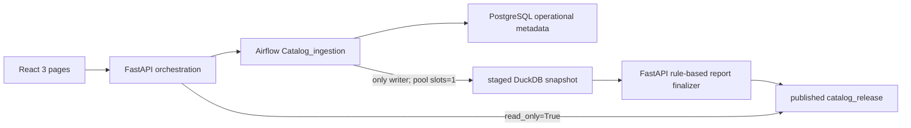

# Review Catalog Platform

실제 모니터 리뷰 데이터에서 Opinion Unit을 추출·정규화하고, 읽기 전용 DuckDB snapshot과 규칙 기반 Markdown 보고서를 하나의 immutable `catalog_release`로 제공하는 FastAPI + React + Airflow 데모다. 로컬 Docker Compose와 단일 AWS EC2 배포를 지원한다.

이 프로젝트는 두 기존 프로젝트의 자산과 계약을 직접 복사해 사용한다.

- `extract_attribute`: 실제 Opinion Unit prompt, strict schema·grounding 계약, Codex CLI 실행 방식, 749개 raw response
- `embedding_clustering_experiment`: Experiment D 결과, cosine complete-linkage cluster, status cannot-link 규칙, 로컬 KR-SBERT 모델, 정적·동적 보고서 계약과 Markdown 형식

원본 두 프로젝트는 수정하지 않았다. 복사 출처를 확인할 수 있도록 `provenance/`에 핵심 소스 snapshot을 보관한다.

## 현재 포함된 실제 데이터

| DuckDB table | rows | source |
|---|---:|---|
| `products` | 9 | `monitor_reviews.parquet.productName` |
| `reviews` | 749 | `monitor_reviews.parquet` |
| `opinion_units` | 2,583 | `monitor_opinion_units.parquet` |
| `representative_attributes` | 2,352 | `monitor_representative_attributes.parquet` |
| `aspect_mapping_table` | 870 | Experiment D aspect nodes |
| `aspect_clusters` | 408 | Experiment D aspect clusters |
| `status_mapping_table` | 1,457 | Experiment D status nodes |
| `status_clusters` | 1,320 | Experiment D status clusters |

Opinion Unit 2,583개 중 2,401개는 Experiment D 결과와 값 그대로 연결되며, `전반적 상품 경험` 182개는 원본을 보존하되 `excluded_taxonomy`로 canonical 집계에서 제외한다. 초기 migration 검증에서는 리뷰·Opinion Unit·정규화 결과의 원본 대비 값 차이가 모두 0건이었다.

`migration/source/`의 Parquet은 최초 이관과 계보 검증을 위한 immutable 입력이다. migration 이후 일상 실행은 Parquet 결과를 새로 만들거나 갱신하지 않고 DuckDB table에만 append한다.

## 전체 흐름



- React는 FastAPI만 호출하며 Airflow REST API를 직접 호출하지 않는다.
- DuckDB write는 `commit_catalog_delta` Airflow task만 수행한다.
- FastAPI와 보고서 생성기는 snapshot을 `read_only=True`로 연다.
- snapshot, 정적 보고서, 이번 UI 제출의 동적 제안서, release manifest가 모두 준비된 뒤 디렉터리 rename 한 번으로 공개한다.
- pipeline run, component version, demo submission, release pointer는 PostgreSQL에 저장한다.

## Opinion Unit 추출

복사된 prompt와 응답 계약은 다음 필드를 강제한다.

```json
{
  "raw_aspect": "평가 대상",
  "raw_status": "상태 또는 null",
  "excerpt": "원문에 포함된 연속 문자열",
  "opinion": "완전한 관찰 또는 평가",
  "sentiment": "positive | negative | mixed | neutral | unknown"
}
```

배송·포장·판매자 서비스·사은품은 제외하며, `excerpt`가 리뷰 원문의 연속 substring이 아니면 validation에서 거부한다. 기본 provider는 원본 프로젝트와 같은 `codex_cli`, `gpt-5.6-luna`, reasoning `high`다. `openai` Responses API adapter도 같은 prompt·schema로 제공한다.

외부 LLM 호출에는 별도 인증이 필요하다. 초기 749건 migration은 이미 검증된 추출 Parquet와 raw Codex response hash를 사용하므로 인증 없이 실행된다. 새 UI 리뷰를 실제로 추출하려면 아래 둘 중 하나를 설정해야 한다.

1. Airflow worker 이미지에 Codex CLI와 ChatGPT 인증을 안전하게 제공하고 `EXTRACTION_BACKEND=codex_cli`를 유지한다.
2. `.env`에 `EXTRACTION_BACKEND=openai`, 사용 가능한 `EXTRACTION_MODEL`, `OPENAI_API_KEY`를 설정한다.

credential이 없을 때 임의 리뷰를 규칙 기반 더미로 대체하지 않는다.

## 실제 mapping table과 신규 표현 추론

활성 버전은 `mapping-table-20260803-213339`이며 normalization run `20260803-213339`의 Experiment D 산출물이다.

1. `raw_aspect`를 870개 `aspect_mapping_table` 표현에서 exact lookup한다.
2. aspect가 exact이면 해당 aspect boundary 안의 1,457개 `status_mapping_table`에서 `raw_status`를 exact lookup한다.
3. exact match는 기존 canonical cluster ID·label과 역사적 mapping distance를 즉시 사용한다.
4. 미등록 표현만 로컬 `snunlp/KR-SBERT-Medium-extended-klueNLItriplet_PARpair_QApair-klueSTS`로 encode한다.
5. 신규 vector와 기존 cluster의 모든 member vector 간 cosine distance를 계산한다. 최대 거리가 aspect `0.3591`, status `0.20` 이하일 때만 complete-linkage 삽입 가능 후보로 표시한다.
6. status는 aspect cluster 내부에서만 비교하며 Experiment D의 opposition group, suffix opposition, explicit negation cannot-link 규칙을 적용한다.
7. 최근접 canonical 거리, complete-link 최대 거리, centroid 거리, 2순위 거리, margin, threshold 통과 여부를 모두 저장한다.

이는 전체 계층적 군집화를 다시 수행하는 작업이 아니다. 신규 표현은 항상 `candidate`이고 `aspect/status` canonical 필드는 확정하지 않는다. mapping table도 자동 변경하지 않는다.

## Airflow DAG

`Catalog_ingestion`은 Asia/Seoul 기준 매일 00:00에 실행하며 FastAPI를 통한 수동·예약 trigger도 지원한다.

```text
register_run
  → resolve_active_versions
  → stage_reviews
  → deduplicate_reviews
  → extract_opinion_units
  → validate_opinion_units
  → map_to_active_taxonomy
  → prepare_catalog_delta
  → commit_catalog_delta              # duckdb_writer_pool, slots=1
  → check_taxonomy_rebuild_condition  # 기록만; rebuild하지 않음
```

최초 snapshot이 없으면 같은 DAG가 원본 3개 Parquet과 Experiment D bundle을 한 번에 atomic migration한다. 이후 catalog mode는 `ingestion/inbox_reviews.json`에서 최대 N건을 읽는다. inbox schema는 다음과 같다.

```json
[
  {
    "source": "catalog_source_name",
    "source_review_id": "external-unique-id",
    "product_id": "existing-or-new-product-id",
    "product_name": "상품명",
    "category": "모니터",
    "review_text": "리뷰 원문"
  }
]
```

### 수동 전체 재군집화

`Catalog_reclustering`은 schedule이 없는 수동 전용 DAG다. 증분 군집 병합 대신 구현이 가장 단순한 전체 재군집화를 사용하며, 현재 정규화 config의 cosine complete-linkage, aspect `0.3591`, status `0.20`, status cannot-link와 대표명 파라미터를 그대로 적용한다.

```bash
docker compose exec airflow-scheduler airflow dags trigger Catalog_reclustering
```

첫 task가 현재 DuckDB snapshot을 작업 디렉터리에 복사해 입력 경계를 고정한다. DAG 실행 중 들어온 리뷰는 유실되지 않지만 새 군집에는 포함되지 않으며 이전 mapping/embedding version을 유지한다. 다음 수동 재군집화 때 전체 입력에 포함된다.

완료 결과는 새 mapping table version, 새 logical embedding model version, cluster/node Parquet과 manifest로 저장된다. SBERT 가중치는 재학습하거나 447 MiB 파일을 매번 복제하지 않고 동일 artifact SHA-256을 새 logical version에서 참조한다. 새 버전은 snapshot과 보고서가 atomic release로 공개될 때 활성화되며 과거 version row와 release는 덮어쓰지 않는다.

## 세 화면

1. **프로젝트**: 이 README를 표시한다.
2. **상품 평가 보고서**: 9개 상품 중 하나를 선택해 현재 release의 정적 Markdown 보고서를 본다.
3. **리뷰 데모**: 한 상품에 리뷰 1~20개를 제출한다. 완료 후 Opinion Unit, exact/candidate 상태와 거리 진단, 리뷰별 동적 의사결정 제안서를 보여준다.

정적 보고서와 동적 제안서는 LLM을 호출하지 않는 단일 함수 진입점에서 규칙 기반으로 생성한다. 동적 제안서는 UI에서 입력한 `demo_review_id`에 대해서만 생성된다.

동적 제안서에서는 `mapped_exact` Opinion Unit만 canonical aspect-status 비교와 대안 상품의 기피 조건에 사용한다. `candidate`와 `excluded_taxonomy` Unit은 다른 리뷰에서 언급됐는지 또는 대안 상품이 이를 보완하는지를 단정하지 않고, 비교·추천 보류 목록과 원인으로 별도 표시한다. 따라서 부정 Unit이 전혀 없는 경우와 부정 Unit은 있으나 canonical pair가 없는 경우를 구분한다.

두 문서의 제목, 섹션 순서, 설명 문구, 표 열과 점수 표기 방식은 `embedding_clustering_experiment/reports/reporting.py`, `dynamic_report.py`, `decision.py`를 기준으로 유지한다. 복사한 원본과 예시는 `provenance/embedding_clustering_experiment/reports/`에 보존하며 다음 계약을 회귀 테스트한다.

- 정적 보고서: 속성 감성 행렬, 속성-상태 행렬, 논쟁 속성, 관련 상품, 약점 보완 대안
- 동적 제안서: 제출 리뷰·Opinion Unit 표와 필드 설명, 다른 리뷰와의 관계, 미언급 조합, 대안 상품 추천

## 버전과 release

Opinion Unit마다 다음 계보를 저장한다.

- prompt version 및 SHA-256
- extraction provider/model version과 raw response SHA-256
- mapping table version
- embedding model artifact SHA-256
- normalization run ID 및 config SHA-256
- ingestion run ID와 생성 시점

release 구조는 다음과 같다.

```text
releases/release-<run_id>/
  catalog.duckdb
  pipeline_manifest.json
  release_manifest.json
  reports/static/<product_id>/static_catalog_report.{json,md}
  reports/dynamic/<demo_review_id>/dynamic_decision_proposal.{json,md}
```

과거 component row, snapshot, report를 덮어쓰지 않는다. 새 version을 등록하고 active pointer만 바꾸며, 모든 report와 snapshot hash를 release manifest에서 검증한다.

## Docker 실행

Docker Desktop 또는 Docker Engine에 최소 8GB RAM을 권장한다. 모든 Airflow 서비스는 하나의 공용 image를 재사용한다. 이 image는 CPU 전용 PyTorch와 `@openai/codex` CLI를 설치하며 로컬 SBERT snapshot은 read-only mount한다.

```bash
cp .env.example .env
docker compose build
docker compose up -d
docker compose ps
```

`codex_cli` extraction을 사용할 때는 scheduler 컨테이너에서 한 번 인증한다.

```bash
docker compose exec airflow-scheduler codex login --device-auth
docker compose exec airflow-scheduler codex login status
```

인증 파일은 모든 Airflow 서비스가 공유하는 `codex_auth` named volume의 `/home/airflow/.codex`에 저장된다. 따라서 일반적인 `docker compose down` 후 `up -d` 또는 image 재빌드 뒤에도 유지된다. `docker compose down -v`는 이 volume까지 삭제하므로 다시 인증해야 한다.

서비스 주소:

- UI: `http://localhost:3000`
- FastAPI/OpenAPI: `http://localhost:8000/docs`
- Airflow: `http://localhost:8080`

Airflow scheduler가 첫 scheduled run을 만들지 않은 환경에서는 migration을 FastAPI로 명시 실행한다.

```bash
curl -X POST http://localhost:8000/api/pipeline-runs \
  -H 'Content-Type: application/json' \
  -d '{}'
```

초기 migration은 항상 749건 전체를 처리한다. `review_limit`로 부분 migration하는 것은 거부한다. 이후 run에서는 `review_limit`가 inbox에서 가져올 N을 의미한다.

## 검증 명령

```bash
cd backend
uv sync --extra embedding --extra reclustering --dev
uv run ruff check src tests
uv run pytest -q

cd ../frontend
npm run build

cd ..
docker compose config --quiet
```

현재 검증 기준:

- backend test 11개 통과
- frontend production build 통과
- Airflow DAG 10개 task 성공
- `duckdb_writer_pool` slot 1 확인
- 실제 migration table count와 원본 값 비교 통과
- 정적 카탈로그 보고서 9개 생성
- Docker 내부 실제 SBERT candidate inference 통과
- UI/API/Airflow health endpoint 정상

## AWS 배포

현재 데모는 서울 리전의 단일 ARM64 EC2에서 Docker Compose로 서비스하고, CloudFront 기본 인증서로 HTTPS를 제공한다. `main` 변경은 GitHub Actions 검증 후 AWS CodeDeploy를 통해 배포된다.

- 공개 URL은 `https://d1my2fe0yb8h33.cloudfront.net`이다.
- EC2 TCP 80은 AWS managed CloudFront origin prefix에서만 접근할 수 있다.
- FastAPI 8000, Airflow API 8080, PostgreSQL 5432는 loopback 또는 Docker network에만 둔다.
- SSH key와 22번 포트를 만들지 않고 SSM Session Manager로 운영한다.
- EC2 role은 SSM core policy와 이 프로젝트의 private 배포 artifact를 읽는 최소 S3 권한만 가진다.
- GitHub Actions는 repository secret이나 장기 AWS key 대신 repository·production environment로 제한된 OIDC role을 사용한다.
- 배포 bundle에는 `.env`, model binary, runtime data, Codex 인증이 포함되지 않는다.
- PostgreSQL secret은 EC2에서 최초 활성화할 때 생성하며 artifact나 repository에 포함하지 않는다.
- `codex_auth` named volume이 Codex CLI 인증을 유지하므로 일반적인 container 재생성 뒤에도 재인증하지 않는다.

실제 리소스, CI/CD 사용법, 배포/복구 명령, 현재 비용 기준은 [`deploy/aws/README.md`](deploy/aws/README.md)에 기록한다. HTTPS는 전송 구간을 보호하지만 애플리케이션 로그인은 없으므로 민감한 리뷰나 credential은 입력하지 않는다.
